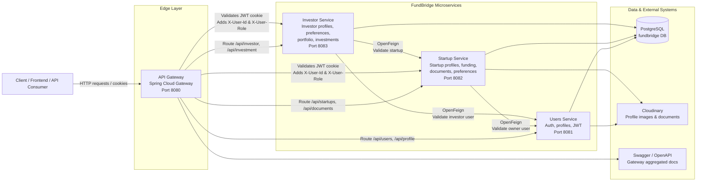

# FundBridge - Startup Investor Marketplace Backend

FundBridge is a Spring Boot microservices backend for a startup-investor marketplace. It allows startup founders to publish startup profiles, funding requirements, and documents, while investors can create profiles, define investment preferences, discover startups, and manage investment portfolio entries.

## Architecture



## Service Responsibilities

| Service | Port | Responsibility |
| --- | --- | --- |
| Gateway | `8080` | Central routing, JWT validation, Swagger aggregation, forwarding authenticated user context |
| Users | `8081` | Registration, login, refresh token, logout, password change, user profile management |
| Startup | `8082` | Startup profile management, funding details, documents, startup filtering |
| Investor | `8083` | Investor profile management, investment preferences, portfolio/investment records |
| PostgreSQL | `5432` | Shared local database for all services |
| pgAdmin | `5050` | Local database administration |

## Key Features

- Microservices-based backend with separate users, startup, investor, and gateway services.
- JWT authentication using access and refresh tokens stored in HTTP-only cookies.
- Role-based authorization for startup and investor workflows.
- API Gateway that validates tokens and forwards `X-User-Id` and `X-User-Role` headers to downstream services.
- PostgreSQL persistence using Spring Data JPA.
- DTO-based request/response models with validation.
- Custom exception handling with consistent error responses.
- OpenFeign-based service-to-service communication.
- Swagger/OpenAPI documentation for service APIs.
- Cloudinary integration for profile images and startup documents.
- Docker Compose setup for PostgreSQL and pgAdmin.
- Environment-based configuration for secrets, database credentials, service URLs, and cookie settings.

## Tech Stack

- Java 21
- Spring Boot
- Spring Security
- Spring Cloud Gateway
- Spring Cloud OpenFeign
- Spring Data JPA / Hibernate
- PostgreSQL
- Docker Compose
- Swagger / OpenAPI
- Cloudinary
- Maven

## Gateway Routes

| Route | Target Service |
| --- | --- |
| `/api/users/**` | Users Service |
| `/api/profile/**` | Users Service |
| `/api/startups/**` | Startup Service |
| `/api/documents/**` | Startup Service |
| `/api/investor/**` | Investor Service |
| `/api/investment/**` | Investor Service |
| `/api/investors/preferences/**` | Investor Service |

Swagger UI is available through the gateway at:

```text
http://localhost:8080/swagger-ui.html
```

## Local Setup

Create a `.env` file in the project root using `.env.example` as a reference.

Required local variables:

```env
POSTGRES_DB=fundbridge
POSTGRES_USER=ajay
POSTGRES_PASSWORD=ajay

DB_URL=jdbc:postgresql://localhost:5432/fundbridge
DB_USERNAME=ajay
DB_PASSWORD=ajay

JWT_SECRET=replace-with-a-long-random-secret

CLOUDINARY_CLOUD_NAME=replace-with-cloud-name
CLOUDINARY_API_KEY=replace-with-api-key
CLOUDINARY_API_SECRET=replace-with-api-secret

COOKIE_SECURE=false
COOKIE_SAME_SITE=Lax
JPA_DDL_AUTO=update
JPA_SHOW_SQL=false

USERS_SERVICE_URL=http://localhost:8081
STARTUP_SERVICE_URL=http://localhost:8082
INVESTOR_SERVICE_URL=http://localhost:8083
```

Start PostgreSQL and pgAdmin:

```bash
docker compose up -d
```

Run the services in this order:

1. Users Service
2. Startup Service
3. Investor Service
4. Gateway

## API Documentation

Each service exposes OpenAPI docs, and the gateway aggregates them:

```text
Gateway Swagger: http://localhost:8080/swagger-ui.html
Users docs:      http://localhost:8081/swagger-ui.html
Startup docs:    http://localhost:8082/swagger-ui.html
Investor docs:   http://localhost:8083/swagger-ui.html
```

## Security Notes

- Secrets are loaded from environment variables instead of being hardcoded.
- JWT is validated at the gateway before protected routes are forwarded.
- Downstream services receive authenticated user context through headers.
- Passwords are stored using BCrypt hashing.
- Cookies are HTTP-only and support configurable `Secure` and `SameSite` flags.
- Real `.env` files should not be committed.

## Project Structure

```text
fundbridge/
  gateway/    # API gateway and JWT request filtering
  users/      # authentication, users, profiles
  startup/    # startup profiles, funding, documents
  investor/   # investor profiles, preferences, investments
  docker-compose.yml
  .env.example
```
